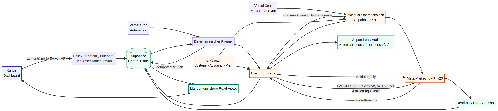

# Adbot Write-Control-Plane Architecture

**Autor:** Manus AI  
**Stand:** 29. Juli 2026  
**Zielplattform:** Next.js 15 auf Vercel, PostgreSQL/Supabase, Meta Marketing API v25  
**Status:** Verbindlicher Architektur- und Implementierungsvertrag für Staging

## 1. Ziel und Sicherheitsmodell

Die Write-Control-Plane erweitert den vorhandenen read-only Meta-Snapshot um eine **deterministische, mandantensichere und idempotente Ausführungsschicht**. Kein UI-Element, keine Recommendation und kein Cron-Aufruf schreibt direkt zu Meta. Jede Änderung wird zunächst als unveränderlich referenzierter Plan erzeugt, gegen den Livezustand und die aktuelle Kundenpolicy validiert, atomar beansprucht, schrittweise ausgeführt und anschließend read-after-write reconciliert.

Vercel-Cron kann Aufrufe auslassen, doppelt zustellen oder überlappend starten. Vercel empfiehlt deshalb ausdrücklich Locks, Idempotenz und reconciliation-basiertes Nachholen.[1] Diese Eigenschaften sind keine Optimierung, sondern Kerninvarianten des Systems.

> **Fail-closed-Invariante:** Wenn Adbot Währung, Accountzuordnung, Policyversion, Meta-Livezustand, Budgetebene, Tagesexposure, Scope, Kill-Switch oder Reconciliation nicht eindeutig bestimmen kann, erfolgt keine auslieferungssteigernde Mutation.



## 2. Komponenten und Vertrauensgrenzen

| Komponente | Aufgabe | Darf Meta mutieren? |
|---|---|---:|
| Dashboard | Policy, Caps, Domains, Blueprints, Assets, Status und Audit darstellen | Nein |
| Authentifizierte Next.js-Server-API | Kundenidentität prüfen und schmale service-role-RPCs aufrufen | Nicht direkt |
| Read-Sync | Meta-Livezustand und Insights unter Account-Lease aktualisieren | Nein |
| Planner | Deterministische Kandidaten aus Snapshot, Recommendations und Policy bilden | Nein |
| Preflight | Lokale Prüfung und Meta-`validate_only` je geplantem Schritt | Nein |
| Claim-RPC | Plan, Account-Lease, Policy, Cooldown und Budgetexposure atomar reservieren | Nein |
| Executor | Ausschließlich beanspruchte Schritte über den Meta-Schreibclient ausführen | Ja |
| Reconciler | Remoteobjekte lesen, Soll/Ist vergleichen und lokale Projektionen aktualisieren | Nein |
| Audit-/Alert-Schicht | Alle Zustandsübergänge, Providerdaten und Abweichungen append-only speichern | Nein |
| Kill-Switch | Neue Claims sperren beziehungsweise explizite Sicherheits-Pausen anfordern | Nur über Executor |

Browserrollen erhalten auf neuen Tabellen keine direkten `INSERT`-, `UPDATE`- oder `DELETE`-Rechte. Supabase empfiehlt RLS für alle Tabellen im exponierten `public`-Schema; Policies wirken als zusätzliche mandantenbezogene Filter.[2] Alle privilegierten Datenbankfunktionen werden als `security definer set search_path = ''` implementiert, vollständig schemaqualifiziert und ausschließlich `service_role` zur Ausführung erteilt.[3]

## 3. Geldmodell und harte Kundencaps

### 3.1 Warum die Summe der Tagesbudgets kein hartes Tageslimit ist

Meta definiert ein Tagesbudget als wöchentlichen Tagesdurchschnitt und nicht als Hard Cap. Die Plattform kann an einzelnen Tagen bis zu 75 Prozent über dem Tagesbudget ausgeben.[4] Bei aktivierter Ad-Set-Budgetfreigabe können zunächst bis zu 20 Prozent geteilt und auf diese Summe wiederum bis zu 75 Prozent Flexibilität angewandt werden; das dokumentierte Worst-Case-Verhältnis beträgt damit `1,20 × 1,75 = 2,10`.[5]

Adbot behandelt das vom Kunden gesetzte Account-Tageslimit daher als **maximal zulässige Tagesexposure**, nicht als bloße Summe der in Meta eingetragenen Budgets.

| Begriff | Einheit | Bedeutung |
|---|---:|---|
| `account_daily_hard_cap_minor` | Integer | Vom Kunden maximal zugelassene Ausgabe im Accounttag |
| `campaign_daily_hard_cap_minor` | Integer | Vom Kunden maximal zugelassene Exposure der Kampagne |
| `daily_budget_minor` | Integer | In Meta gesetztes durchschnittliches Tagesbudget |
| `flex_spend_multiplier_bps` | Basispunkte | `17500` ohne Sharing; `21000` bei Sharing oder unbekanntem Sharingzustand |
| `reserved_exposure_minor` | Integer | Konservative Obergrenze `ceil(max_budget_today × multiplier / 10000)` |
| `account_day` | Datum | Kalendertag in der von Meta gelesenen Werbekonto-Zeitzone |

### 3.2 Exposure-Ledger

Für jeden Budgetowner, der an einem Accounttag aktiv war oder aktiviert werden soll, speichert Adbot das höchste an diesem Tag beobachtete oder gesetzte Tagesbudget. Eine Budgetsenkung oder Pause gibt diese Reserve **nicht am selben Tag** frei, weil vor der Änderung entstandene Auslieferung weiterhin abgerechnet werden kann und Meta bei Budgetänderungen auf den höchsten Tageswert abstellt.[5]

Für einen Accounttag `d` gilt:

```text
object_exposure(o,d) = ceil(max_budget_seen_or_planned(o,d) × multiplier(o,d) / 10000)
account_exposure(d)  = Σ object_exposure(o,d)
account_exposure(d) ≤ account_daily_hard_cap_minor
campaign_exposure(c,d) ≤ campaign_daily_hard_cap_minor(c)
```

Die Summe enthält genau die Budgetowner der Livekonfiguration: Bei Campaign Budget Optimization wird nur das Kampagnenbudget reserviert; andernfalls werden die Ad-Set-Budgets reserviert. Kampagnen- und Ad-Set-Budget dürfen niemals gleichzeitig als steuernde Budgets derselben Kette gezählt oder mutiert werden.

| Situation | Exposure-Regel |
|---|---|
| Budgeterhöhung | Reserve wird vor dem Claim auf das neue Tagesmaximum angehoben |
| Budgetsenkung | Reserve bleibt bis zum nächsten Accounttag auf dem bisherigen Maximum |
| Pause | Reserve bleibt für den laufenden Accounttag bestehen |
| Aktivierung | Volle konservative Tagesexposure wird vor Ausführung reserviert |
| Neues Objekt zur Tagesmitte | Volle Tagesexposure wird reserviert; keine unsichere Zeitanteilsannahme |
| Ad-Set-Sharing unbekannt | Multiplikator `21000`, bis der Zustand sicher gelesen wird |
| Lifetime-Budget | Der gesamte noch verfügbare Rest zählt als Tagesexposure; ist er nicht sicher bestimmbar, wird Aktivierung blockiert |
| Account-Zeitzone unbekannt | Keine auslieferungssteigernde Mutation |
| Währung nicht EUR | Keine Autonomie in der ersten Write-Version; kein automatischer FX-Pfad |

Diese Konservativität schützt Adbot-gesteuerte Änderungen innerhalb der dokumentierten Meta-Flexibilität. Manuelle Änderungen direkt in Meta liegen außerhalb der atomaren Kontrolle. Der nächste Read-Sync übernimmt erkannte höhere Budgets in das Exposure-Ledger, suspendiert die Policy bei Überschreitung und erzeugt bei aktivierter Sicherheitsoption priorisierte Pause-Pläne für Adbot-verwaltete Objekte.

## 4. Rollierende 20-Prozent-Grenze und Cooldown

Budgetmutationen werden in einem append-only Ledger gespeichert. Für einen Budgetowner wird bei jedem Claim das rollierende Fenster `(now() - 24 hours, now()]` neu berechnet.

```text
window_baseline = before_budget der ältesten erfolgreichen Budgetmutation im Fenster
                  oder aktuelles Livebudget, wenn das Fenster leer ist
used_movement   = Σ abs(after_budget - before_budget) aller erfolgreichen Mutationen im Fenster
candidate_move  = abs(planned_after - live_before)
allowed_move    = floor(window_baseline × 2000 / 10000)

used_movement + candidate_move ≤ allowed_move
```

Die Summe absoluter Bewegungen verhindert ein Umgehen durch Erhöhen und anschließendes Senken. Zusätzlich muss das geplante Budget innerhalb von `80 % … 120 %` der Fensterbaseline liegen. Rundung erfolgt immer konservativ auf ganze Minor Units.

Der **12-Stunden-Cooldown gilt pro Remoteobjekt nach jeder erfolgreichen nicht-sicherheitsbezogenen Mutation**. Ein Plan, der während des Cooldowns entsteht, wird nicht über zwölf Stunden in einer alten Form aufbewahrt, sondern mit `BLOCKED_COOLDOWN` beendet und nach Ablauf aus einem frischen Snapshot neu geplant. Eine explizite Sicherheits-Pause darf den Cooldown umgehen; Aktivierung, Budgeterhöhung und normale Statusänderungen dürfen das nicht.

## 5. Datenmodell

### 5.1 Kernobjekte

| Tabelle | Zweck | Wesentliche Invarianten |
|---|---|---|
| `automation_policies` | Versionierte Kundenpolicy je Meta-Account | Genau eine aktuelle Version; `ACTIVE` nur mit EUR, Accountcap, Kampagnendefault, Scope, Domain-/Blueprint-Readiness |
| `allowed_domains` | Kundenseitig bestätigte HTTPS-Domains | Normalisierter ASCII-Hostname; Redirect-Endhost; Status `PENDING/VERIFIED/REVOKED` |
| `objective_blueprints` | Versionierte Payloadverträge pro Meta-Ziel | Immutable Version/Hash; Pflichtinputs; Ziel-, Optimierungs-, Billing-, Targeting- und Compliancefelder |
| `brand_assets` | Vorhandene, hochgeladene oder erzeugte Markenassets | Provider/Modell/Version, SHA-256, MIME, Dimensionen, Policyversion, Moderation, Meta-Hash |
| `automation_targets` | Explizit verwaltete Campaign-/Ad-Set-/Ad-Objekte | Mandant und Account unveränderlich; Remote-ID; Budgetowner; `last_successful_mutation_at` |
| `daily_budget_exposures` | Konservative Reserve je Accounttag und Budgetowner | Unique Accounttag/Target; Tagesmaximum darf nur steigen; Multiplikator versioniert |
| `budget_mutation_ledger` | Erfolgreiche Budgetbewegungen | Append-only; Before/After, absoluter Delta, Remotezeit, Execution-ID |
| `mutation_plans` | Idempotente, ausführbare Solländerung | Unique `idempotency_key`; immutable Sollpayload; Policy-/Snapshotreferenz; Leasezustand |
| `mutation_plan_steps` | Geordnete Saga-Schritte | Feste Reihenfolge, Abhängigkeiten, eigener Request-Fingerprint und Compensationtyp |
| `mutation_executions` | Ein Ausführungsversuch eines Plans | Attemptnummer, Worker-ID, Lease, Start/Ende, Ergebnis und Fehlerklasse |
| `mutation_audit_events` | Unveränderliche Eventfolge | Before/Request/Response/After, Hashkette, Providerdaten, keine Tokens |
| `remote_object_bindings` | Lokale Bindung eines Planschritts an Meta-ID | Unique Plan/Step und Account/Objekttyp/Remote-ID; Fingerprint bestätigt |
| `kill_switch_state` | System-, Account- oder Plan-Sperre | Hierarchie System > Account > Plan; append-only Zustandswechsel oder versionierte aktive Zeile |
| `automation_alerts` | Kunden- und Betriebswarnungen | Dedup-Key, Severity, Blocker, Auflösung und Auditreferenz |

Jede Tabelle enthält `user_id` und `platform_account_id`, sofern der Scope nicht bewusst systemweit ist. Fremdschlüssel dürfen Auditdaten nicht per `ON DELETE CASCADE` entfernen; Account- oder Benutzerlöschung muss zuerst einen geregelten Export-/Archivpfad durchlaufen.

### 5.2 Policyzustände

| Zustand | Bedeutung | Claims erlaubt? |
|---|---|---:|
| `OFF` | Kunde hat Autonomie deaktiviert | Nein |
| `READY` | Konfiguration ist vollständig, aber nicht aktiviert | Nein |
| `ACTIVE` | Alle Gates bestanden | Ja |
| `SUSPENDED` | Technischer, Scope-, Sync-, Cap- oder Reconciliationblocker | Nein |
| `EMERGENCY_STOP` | Kunde/System hat Auslieferungsstopp angefordert | Nur priorisierte Safety-Pause |

Eine Planzeile referenziert immer die exakte `automation_policy_id` und deren Payloadhash. Eine neue Policyversion macht noch nicht beanspruchte Pläne der alten Version `STALE`.

### 5.3 Plan- und Ausführungszustände

| Planstatus | Semantik |
|---|---|
| `PENDING` | Deterministisch geplant, noch nicht validiert oder beansprucht |
| `PREFLIGHT_FAILED` | Lokale oder Meta-`validate_only`-Prüfung dauerhaft fehlgeschlagen |
| `CLAIMED` | Atomar beansprucht; Account-Lease und gegebenenfalls Exposure reserviert |
| `EXECUTING` | Mindestens ein Remote-Schreibschritt läuft |
| `RECONCILING` | Alle erwarteten Writes wurden gesendet; Remotezustand wird gelesen |
| `SUCCEEDED` | Sollzustand und Bindings vollständig reconciliert |
| `RETRYABLE` | Nur sicher wiederholbarer Schritt; `not_before` mit Backoff gesetzt |
| `BLOCKED` | Policy, Cap, Cooldown, Scope, Staleness oder Kill-Switch verhindert Ausführung |
| `COMPENSATION_REQUIRED` | Teilobjekte oder ambiger Remotezustand erfordern sichere Behandlung |
| `FAILED` | Dauerhafter nicht-Compliance-bezogener Fehler ohne aktive Teilkette |
| `CANCELLED` | Vom Kunden/System vor erstem Write beendet |
| `STALE` | Snapshot, Policy oder Sollzustand wurde überholt |

Nur `PENDING` und `RETRYABLE` sind claimbar. Terminale Zustände werden nie in-place zurückgesetzt; ein neuer Versuch nach fachlicher Änderung ist ein neuer Plan mit neuem Idempotenzschlüssel.

## 6. Idempotenz und Account-Leases

### 6.1 Idempotenzschlüssel

Der Planner bildet einen kanonischen JSON-Payload und berechnet:

```text
sha256(
  user_id | platform_account_id | action_type | target_key |
  policy_id | policy_hash | source_rule_version | source_snapshot_id |
  canonical_expected_before | canonical_intended_after
)
```

Ein Unique Index auf `mutation_plans.idempotency_key` verhindert doppelte Pläne. Derselbe fachliche Wunsch aus einem unveränderten Snapshot führt damit zur vorhandenen Zeile, während ein neuer Snapshot oder eine neue Policy eine neue, erneut zu prüfende Entscheidung erzeugt.

### 6.2 Gemeinsame Meta-Account-Lease

Read-Sync und Write-Executor teilen künftig eine Tabelle `meta_account_operation_leases`. Pro `platform_account_id` kann genau eine Lease aktiv sein. Die Claim-RPC aktualisiert die Lease nur, wenn sie abgelaufen ist, und liefert ein zufälliges Lease-Token. Der Token muss bei jedem Zustandswechsel und beim Release übereinstimmen.

Die bestehende `claim_meta_sync`-Funktion wird so erweitert, dass sie zusätzlich eine Operation-Lease vom Typ `READ_SYNC` erwirbt. Der Executor nutzt `WRITE_EXECUTION`. Damit kann ein Snapshot nicht parallel zu einer Meta-Mutation als atomar vollständig markiert werden.

Die Planqueue verwendet kurze PostgreSQL-Transaktionen und `FOR UPDATE SKIP LOCKED`, um konkurrierende Worker ohne Doppelclaim auf verschiedene fällige Zeilen zu verteilen.[6] Eine Datenbanktransaktion bleibt niemals während eines HTTP-Aufrufs offen.

## 7. Claim-Protokoll

`claim_meta_mutation_plan(...)` ist service-role-only und führt in einer Transaktion folgende Prüfungen aus:

| Reihenfolge | Atomare Prüfung oder Änderung |
|---:|---|
| 1 | Fälligen Plan mit `FOR UPDATE SKIP LOCKED` auswählen |
| 2 | Tenant-, Account-, Remoteobjekt- und Connectorzuordnung prüfen |
| 3 | System-, Account- und Planschalter auswerten |
| 4 | Policy `ACTIVE`, aktuell, kundenseitig bestätigt und Hash identisch prüfen |
| 5 | `ads_management`, Ad-Account-Granular-Scope, Tokenlaufzeit und Marketing-Accountstatus prüfen |
| 6 | Snapshot-ID, Freshness, Währung und Accountzeitzone prüfen |
| 7 | Erwarteten Before-Zustand gegen lokale Projektion prüfen |
| 8 | Objektcooldown und rollierendes 24-Stunden-Ledger prüfen |
| 9 | Account- und Kampagnenexposure unter Row Locks berechnen und reservieren |
| 10 | Operation-Lease und Planlease setzen, Attemptnummer erhöhen, Audit-Claim-Event einfügen |

Meta-`validate_only` erfolgt vor dem fachlichen Claim für den jeweils unmittelbar folgenden Mutationsschritt. Nach erfolgreicher Vorprüfung übergibt der Executor den Validation-Fingerprint an die Claim-RPC. Der Claim akzeptiert ihn nur, wenn Payload, Policy und Live-Before-Fingerprint unverändert sind.

Unmittelbar vor jedem tatsächlichen Meta-Write ruft der Executor eine leichte `assert_meta_mutation_guard(plan_id, lease_token, step_id)`-RPC auf. Damit wirken zwischen Claim und Schritt gesetzte Kill-Switches. Eine externe HTTP-Anfrage kann naturgemäß nicht atomar mit einer PostgreSQL-Transaktion gekoppelt werden; deshalb wird nach jedem Write zwingend reconciliert.

## 8. Atomic Active-Launch als Saga

Meta stellt keine gemeinsame Transaktion über Kampagne, Ad Set, Creative und Ad bereit. Adbot verwendet deshalb eine **vorwärtsgerichtete Saga mit sicherem PAUSED-Schattenzustand**. Die Eltern werden erst am Ende aktiviert; automatische Löschung ist ausgeschlossen.

### 8.1 Neue vollständige Kette

| Schritt | Aktion | Erwarteter sicherer Zustand |
|---:|---|---|
| 1 | Lokale Policy-, Domain-, Blueprint-, Asset-, Cap- und Scopeprüfung | Keine Remoteänderung |
| 2 | Kampagne mit `validate_only`, inklusive `special_ad_categories` | Keine Remoteänderung |
| 3 | Plan claimen und Exposure reservieren | Lease aktiv |
| 4 | Kampagne real als `PAUSED` erstellen, Remote-ID binden, lesen | Keine Auslieferung |
| 5 | Ad Set mit realer Campaign-ID `validate_only`, dann `PAUSED` erstellen und lesen | Keine Auslieferung |
| 6 | Bild wiederverwenden oder hochladen; Creative `validate_only`, erstellen und lesen | Keine Auslieferung |
| 7 | Ad mit realen IDs `validate_only`, als `ACTIVE` unter pausierten Eltern erstellen und lesen | Konfiguriert aktiv, effektive Auslieferung blockiert |
| 8 | Ad Set aktivieren und lesen | Kampagne blockiert weiterhin Auslieferung |
| 9 | Finalen Guard und Hard-Cap erneut prüfen; Kampagne zuletzt aktivieren | Auslieferung freigegeben |
| 10 | Gesamte Kette read-after-write reconciliieren | `SUCCEEDED` oder Compensationpfad |

Die produktive Materialisierung erfolgt ausschließlich über die service-role-RPC `materialize_meta_launch_chain_plan`. Sie erzeugt Plan, 20 geordnete Saga-Schritte und eine provisorische Tagesbudget-Exposure in **einer Datenbanktransaktion**. Ein SHA-256-Schlüssel über die kanonischen Kundeneingaben macht Wiederholungen idempotent; ein zweiter identischer Aufruf liefert denselben Plan und reserviert kein weiteres Budget.

| Materializer-Gate | Durchgesetzter Vertrag |
|---|---|
| Autonomie | Aktuelle, aktive EUR-Policy mit `allow_new_launches` und `allow_status_changes` |
| Kundengrenzen | Account- und Kampagnenhardcap vorhanden; Budgetebene eindeutig `CAMPAIGN` oder `AD_SET` |
| Snapshot | Vollständiger, frischer Marketing-Snapshot unter exklusiver `READ_SYNC`-Accountlease |
| Domain | HTTPS-Ziel ohne Userinfo oder Fragment; verifizierter erwarteter und beobachteter Host |
| Blueprint | Aktive bestätigte Version; bekannte Objektsektionen und objektbezogene Meta-Feld-Allowlist |
| Brand | Aktives bestätigtes Profil; genau ein `READY`/`APPROVED` Asset derselben Profil- und Policyversion |
| Payload | Größenbegrenzung, rekursive Secret-Key-Sperre und keine Remote-ID aus Kundeneingaben |
| Exposure | Reservierung gegen effektives Meta-Flexspend-Maximum unter Account-/Policy-/Snapshot-Locks |

Remote-IDs werden erst durch erfolgreiche Create-Schritte in `remote_object_bindings` geschrieben und anschließend in abhängige Payloads eingesetzt. Die LAUNCH-spezifische Reconciliation verlangt aktuelle Read-backs für Campaign, Ad Set, Creative und Ad, verifiziert Hierarchie, Endstatus und Budgetebene, materialisiert die vier lokalen Projektionen und erzeugt kanonische `automation_targets`. Die provisorische `launch:*`-Exposure wird unter denselben Sperren atomar durch die kanonische Remote-ID-Exposure ersetzt; dadurch zählt sie nie doppelt gegen das Kundenlimit. Auch eine IMAGE-Bindung gilt erst nach erfolgreicher Zuordnung ihres Meta-Hashes als reconciliert.

Meta kann eine konfigurierte `ACTIVE`-Ad zunächst in einen Review-/Pending-Zustand überführen. Das ist kein technischer Fehler, solange IDs, konfigurierte Statuswerte, Creativebindung und erwartete Reviewfelder übereinstimmen. Eine Ablehnung oder Complianceverletzung blockiert den Plan dauerhaft; Adbot versucht keine Umgehung.

### 8.2 Neue Ad in bereits aktiver Kette

Bei aktiven Eltern wird die neue Ad zunächst `PAUSED` erstellt, vollständig reconciliert und erst im letzten Schritt auf `ACTIVE` gesetzt. Dadurch liefert kein ungebundenes oder ungeprüftes Creative aus. Der kundenseitig sichtbare erfolgreiche Endzustand bleibt `ACTIVE`.

### 8.3 Ambige Create-Antworten

Meta-Create-Aufrufe werden nicht blind wiederholt. Jeder Objektname enthält einen deterministischen, kundenunschädlichen Tracking-Suffix aus Plan- und Schritt-ID. Nach Timeout oder Verbindungsabbruch sucht der Reconciler im richtigen Account nach exakt diesem Namen und vergleicht den erwarteten Fingerprint.

| Fund | Verhalten |
|---:|---|
| Genau ein passendes Objekt | Remote-ID binden und Saga fortsetzen |
| Kein Objekt, Meta bestätigt Nichtanlage | Derselbe Schritt darf mit gleichem Plan retryen |
| Kein Objekt, Ergebnis bleibt ambig | `COMPENSATION_REQUIRED`, keine Create-Wiederholung |
| Mehr als ein passendes Objekt | `COMPENSATION_REQUIRED`, Account suspendieren, keine Löschung |

Updates sind zustandssetzend und werden vor Retry gelesen. Ist der Sollzustand bereits vorhanden, wird der Schritt als reconciliert abgeschlossen; andernfalls darf derselbe gewünschte Wert erneut gesendet werden.

## 9. Compensation und Fehlerklassen

| Fehlerklasse | Beispiel | Automatisches Verhalten |
|---|---|---|
| `VALIDATION_PERMANENT` | Ungültiges Ziel-/Creative-Payload | `PREFLIGHT_FAILED`, Alert, kein Write |
| `COMPLIANCE_BLOCK` | Meta Policy/Review/Restricted Content | Dauerhaft blockieren und melden; keine Umgehung |
| `RATE_LIMIT_TRANSIENT` | Meta Rate Limit | `RETRYABLE`, Backoff, Lease freigeben |
| `AUTH_SCOPE` | Token abgelaufen oder `ads_management` fehlt | Policy `SUSPENDED`, Reconnect erforderlich |
| `REMOTE_AMBIGUOUS` | Create-Timeout ohne eindeutigen Fund | `COMPENSATION_REQUIRED` |
| `RECONCILIATION_MISMATCH` | Remote After weicht vom Soll ab | Account `SUSPENDED`; sichere Pause versuchen, wenn Auslieferung möglich ist |
| `CAP_OR_POLICY_CHANGED` | Limit oder Policy nach Preflight geändert | `BLOCKED`/`STALE`, kein Write |
| `PARTIAL_CHAIN_SAFE` | Kampagne/Ad Set angelegt, Eltern PAUSED | `COMPENSATION_REQUIRED`; PAUSED belassen |
| `PARTIAL_CHAIN_DELIVERING` | Finalaktivierung teilweise erfolgt | Sofortige idempotente Pause des obersten kontrollierbaren Parents, dann `COMPENSATION_REQUIRED` |

Adbot löscht keine teilweise angelegten Objekte automatisch und aktiviert keine verwaisten Objekte. Sichere Pausen sind erlaubt, weil sie Exposure reduzieren; jeder Compensationversuch ist selbst ein auditierter Stepsatz.

## 10. Kill-Switch-Hierarchie

Die effektive Sperre wird in der Reihenfolge **System > Account > Plan** bestimmt. Jeder Scope unterstützt drei Modi.

| Modus | Neue normale Claims | Laufender Plan | Meta-Sicherheits-Pause |
|---|---:|---|---:|
| `ALLOW` | Ja | Fortsetzen | Falls erforderlich |
| `FREEZE_WRITES` | Nein | Vor nächstem Schritt stoppen | Nein, außer bereits explizit angefordert |
| `PAUSE_MANAGED` | Nein | In Compensation wechseln | Ja; danach Scope einfrieren |

Ein Systemfreeze ist der äußerste technische Not-Aus und kann bewusst sämtliche Outbound-Writes blockieren. Ein Hard-Cap-Alarm setzt dagegen Accountmodus `PAUSE_MANAGED`, damit verwaltete ausliefernde Ketten sicher pausiert werden können. Browser und Cron dürfen einen Switch nicht direkt tabellarisch ändern; sie rufen eine enge, auditierende service-role-RPC über die Server-API auf.

## 11. Audit und Nachweisbarkeit

Jeder Plan erzeugt eine chronologische Eventkette. Ein Event enthält mindestens `plan_id`, `execution_id`, `step_id`, Actor, Timestamp, Eventtyp, sanitierten Before-Snapshot, Requestpayload, Responsemetadaten, Remote-After, Meta-Request-ID, Provider/Modell für Assets, Fehlerklasse, vorherigen Eventhash und eigenen SHA-256-Hash.

Tokens, Authorization-Header, Providersecrets, komplette personenbezogene Audience-Daten und ungefilterte Meta-Fehlerpayloads werden nie gespeichert. Stattdessen speichert Adbot strukturierte Allowlistfelder und gehashte Payloadfingerprints. Ein Datenbanktrigger verweigert `UPDATE` und `DELETE` auf Audit- und Budgetledger-Tabellen. Korrekturen werden als neues Event angehängt.

| Nachweisfrage | Auditantwort |
|---|---|
| Wer hat Autonomie aktiviert? | Policyversion, Actor-ID und `customer_confirmed_at` |
| Warum wurde eine Aktion geplant? | Rule-/Planner-Version, Evidence und Snapshot-ID |
| Welche Grenze galt? | Policyhash, Account-/Kampagnencap und Exposureberechnung |
| Was wurde zu Meta gesendet? | Sanitierter Request, Fingerprint und Meta-Request-ID |
| Was existierte danach? | Read-after-write-Remote-Snapshot und Binding |
| Woher kam ein Asset? | Origin, Provider, Modell/Vorlage, Prompt-/Inputhash, SHA-256, Moderation und Meta-Image-Hash |
| Wurde ein Fehler umgangen? | Fehlerklasse, terminaler Blockstatus und fehlende Folgemutation |

## 12. Cron- und Laufzeitmodell

Betriebsmodell A bleibt vollständig serverlos. Der bestehende stündliche Meta-Read-Sync bleibt bestehen. Getrennte, mit `CRON_SECRET` authentifizierte Routen verarbeiten Creative-Asset-Jobs und bereits materialisierte Mutationspläne in kleinen, zeitlich begrenzten Einheiten. Vercel sendet `CRON_SECRET` als Authorization-Header und weist darauf hin, dass Funktionslimits auch für Cron gelten.[1]

| Route | Takt | Verantwortlichkeit |
|---|---|---|
| `/api/cron/meta-sync` | Stündlich | Accountweise Operation-Lease, Live-Snapshot, Insights, manuelle Änderungen erkennen |
| `/api/cron/creative-assets` | Alle fünf Minuten | Fällige Creative-Asset-Jobs claimen, Providerergebnis moderieren und Assetherkunft persistieren |
| `/api/cron/meta-executor` | Jede Minute | Genau einen fälligen Plan claimen und seine ausführbaren Steps bis zum Abschluss, Retry oder Blockzustand verarbeiten |
| `/api/automation/*` | Kundenaktion | Policy-/Domain-/Blueprint-/Kill-Switch-Kommandos über serverseitige Autorisierung |

Die ausgelieferte Executor-Route läuft in der Node.js-Runtime mit `maxDuration = 300`, prüft `Authorization: Bearer CRON_SECRET` konstantzeitlich und antwortet mit `Cache-Control: private, no-store`. Sie gibt ausschließlich die sanitisierten Felder `ok`, `processed`, `outcome` und `steps` zurück; Plan-, Execution-, Account- und Remote-IDs verlassen die Route nicht. Pro Invocation wird höchstens ein Plan geclaimt. Der nächste Minutenlauf greift fällige Retries oder abgelaufene Leases auf, sodass die Ausführung nicht von einem einzelnen Cronlauf abhängt.

## 13. API- und Codegrenzen

| Modul | Vertrag |
|---|---|
| `src/lib/meta/client.ts` | GET und explizite POST-Methoden; Timeout, Meta-Fehler, Request-ID, Usage; keine Businesslogik |
| `src/lib/meta/write-contracts.ts` | Typisierte Allowlist-Payloads und kanonische Fingerprints |
| `src/lib/meta/planner.ts` | Reine deterministische Funktionen ohne Netzwerk oder service role |
| `src/lib/meta/executor.ts` | Saga-Orchestrierung; ausschließlich geclaimte Pläne, Binding-Auflösung, `validate_only`, Remote-Writes, READ und Reconciliation |
| `src/app/api/cron/meta-executor/route.ts` | Konstantzeitlich geschützte Ein-Plan-Cron-Invocation mit sanitisiertem Ergebnis |
| `20260729220000_meta_mutation_executor.sql` | Claims, Guards, Dispatchzustand, Snapshots, Fehlerklassifikation und generische Reconciliation-Basis |
| `20260729230000_meta_launch_chain.sql` | Atomarer Active-Launch-Materializer sowie LAUNCH-spezifische Projektion, Bindings und Exposure-Kanonisierung |
| `src/lib/automation/policy.ts` | Policy-/Cap-/Blueprintvalidierung |
| `src/lib/automation/budget.ts` | Minor-Unit-, Flexspend-, 20-Prozent- und Cooldownarithmetik |
| `src/lib/brand-assets/provider.ts` | Austauschbares Providerinterface; keine Manus-Abhängigkeit |
| Supabase-RPCs | Atomare Claims, Leases, Exposurereserven, Ledger und Auditappend |

Keine Provider- oder Meta-Entscheidung wird in React-Komponenten implementiert. Keine Planlogik vertraut clientseitig berechneten Geldwerten. Kein TypeScript-Executor darf einen Meta-Write ausführen, ohne gültige Plan-ID, Step-ID und Lease-Token aus der Claim-RPC erhalten zu haben.

## 14. Verbindliche Abnahmematrix für die Implementierung

| Invariante | Erforderlicher Regressionstest |
|---|---|
| Ohne beide Kundencaps keine Autonomie | Aktivierungs-RPC verweigert `ACTIVE` |
| Meta-Flexspend überschreitet Kundencap nicht | Exposurefaktor 1,75/2,10, Tagesmaximum und Rundung testen |
| Budgetebene wird nicht doppelt gezählt | Campaign-Budget gegen Ad-Set-Budget-Fälle testen |
| 20 Prozent sind rollierend kumulativ | Mehrfachänderung und Hin-und-her-Fall testen |
| Cooldown ist objektbezogen | Zwei Targets parallel erlaubt; dasselbe Target zwölf Stunden blockiert |
| Doppelter Cron erzeugt keine Doppelmutation | Parallelclaim plus Unique Idempotency testen |
| Read-Sync und Write laufen nicht parallel | Gemeinsame Account-Lease testen |
| Kill-Switch wirkt vor jedem Write | Switch zwischen Steps setzen und Folgewrite blockieren |
| Create-Timeout wird nicht blind wiederholt | 0/1/2 Remote-Fundfälle testen |
| Teilkette liefert nicht unkontrolliert | Eltern PAUSED und Compensation-Safety-Pause testen |
| Audit ist vollständig und unveränderlich | Before/Request/Response/After sowie UPDATE/DELETE-Verbot testen |
| Fremder Mandant sieht oder ändert nichts | RLS, Grants und service-role-RPC-Tenantscope testen |
| Compliancefehler wird nicht umgangen | Terminalstatus ohne alternativen Payloadretry testen |
| Reconciliation ist Pflicht | Kein `SUCCEEDED` ohne bestätigten Remote-After-Zustand |
| Active Launch bleibt bis zuletzt sicher | Exakte 20-Step-Reihenfolge, PAUSED Parents, ACTIVE Shadow-Ad und finale Campaign-Aktivierung testen |
| Launch-Replay reserviert nicht doppelt | Zweiter Materializer-Aufruf liefert denselben Plan und genau eine Exposure |
| Launch-Hierarchie ist kanonisch | Vier Remote-Read-backs, lokale Projektionen, drei Managed Targets und fünf reconciled Bindings testen |
| Provisorische Exposure bleibt nicht bestehen | `launch:*` wird atomar durch Campaign-/Ad-Set-Remote-Keys ersetzt |
| Browser darf Launch-RPCs nicht ausführen | `authenticated` und `anon` besitzen kein `EXECUTE` auf Materializer, Executor oder private Reconciliation-Basis |

## 15. Implementierungsstand und Verifikation

Der Control-Plane-, Creative-Asset-, Budget-Planner-, Mutation-Executor- und Active-Launch-Stand ist als vorwärtsgerichtete Migration implementiert. `scripts/test-meta-mutation-executor.sql` führt auf einem frischen PostgreSQL-Cluster die vollständige 20-Schritt-Kette mit synthetischen Meta-Antworten und vier Read-after-write-Snapshots aus. Der Test verlangt den finalen Zustand `SUCCEEDED`, aktive lokale Campaign/Ad-Set/Ad-Projektionen, Creativebindung, drei kanonische Managed Targets, fünf geschlossene Remote-Bindings, genau eine kanonische Exposure und keine verbleibende Accountlease.

| Nachweis | Ausführbarer Befehl |
|---|---|
| Kanonische vollständige Meta-Release-Matrix | `npm run test:meta-all` |
| Vollständiger Fresh-Cluster-Migrations- und SQL-Regressionslauf | `npm run test:meta-write-control-plane` |
| Isolierter TypeScript-Executor- und Cron-Vertrag | `npm run test:meta-mutation-executor` |
| Produktionskompilierung | `npm run build` |
| Statische Prüfung | `npm run lint` |
| Typprüfung | `npx tsc --noEmit` |

Die numerischen Randwerte, Fail-closed Zustände und noch ausstehenden externen Staging-Gates sind im [`RELEASE_SAFETY_EVIDENCE.md`](./RELEASE_SAFETY_EVIDENCE.md) mit Durchsetzungsort und ausführbarer Regression dokumentiert.

Die Browserrollen besitzen weder Tabellen-Schreibrechte noch `EXECUTE` auf Materializer-, Executor-, Dispatch-, Snapshot-, Completion- oder Reconciliation-RPCs. Nur der serverseitige Executor mit service role darf einen geclaimten Plan gegen Meta ausführen.

## References

[1]: https://vercel.com/docs/cron-jobs/manage-cron-jobs "Vercel – Managing Cron Jobs"
[2]: https://supabase.com/docs/guides/database/postgres/row-level-security "Supabase – Row Level Security"
[3]: https://supabase.com/docs/guides/database/functions "Supabase – Database Functions"
[4]: https://www.facebook.com/business/help/214319341922580 "Meta Business Help Center – About budgets"
[5]: https://www.facebook.com/business/help/190490051321426 "Meta Business Help Center – About Daily Budgets"
[6]: https://www.postgresql.org/docs/current/sql-select.html "PostgreSQL – SELECT and SKIP LOCKED"
